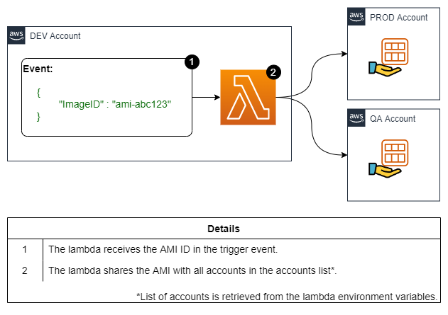

# Share AMI between different AWS accounts

A simple lambda function that you can use to share AMIs between AWS accounts.

> :warning:	This is not a finished product, it's just a template to get you started.

## Resources deployed by this manifest:

- Python Lambda Function
- Lambda IAM Policy and Role

### Deployment diagram:



## Tested with: 

| Environment | Application | Version  |
| ----------------- |-----------|---------|
| WSL2 Ubuntu 20.04 | Terraform | v1.1.9  |

## Initialization How-To:
Located in the root directory, make an "aws configure" to log into the aws account, and a "terraform init" to download the necessary modules and start the backend.

```bash
aws configure
terraform init
```

## Deployment How-To:

Located in the root directory, make the necessary changes in the variables.tf, create a file called poc.auto.tfvars with a content like the following:

```bash
aws_profile = "YourProfile"
account_list = {
  PROD = "0123456789001", # Your PRD AWS Account ID
  QA  = "1009876543210" # Your QA AWS Account ID
}
```

And run the manifests:

```bash
terraform apply
```

## Author:

- [@JManzur](https://jmanzur.com)

## Documentation:

- [Boto3 Docs: "modify_image_attribute"](https://boto3.amazonaws.com/v1/documentation/api/latest/reference/services/ec2.html#EC2.Client.modify_image_attribute)
- [AWS Docs: Share an AMI with specific AWS accounts](https://docs.aws.amazon.com/AWSEC2/latest/UserGuide/sharingamis-explicit.html)